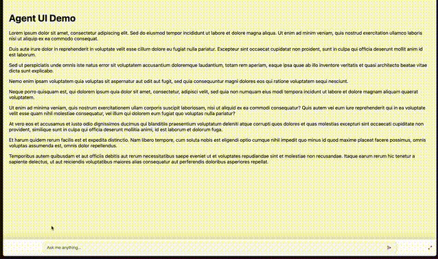

# Agent UI

A modern, responsive, accessible chat widget that can unobtrusively be added to any web application. Built with [TypeScript](https://github.com/microsoft/TypeScript), [Lit](https://github.com/lit/lit), [Marked](https://github.com/markedjs/marked), [DOMPurity](https://github.com/cure53/DOMPurify), [Lucide Icons](https://github.com/lucide-icons/lucide).



As agents become a deeper, more prominent part of applications—and increasingly the primary interface—Agent UI offers an opinionated, transitional design that makes chat and commands an accessible, ever‑present capability without getting in your way. It’s always available via the bottom command line, and when you engage it, it adapts to the appropriate modality and space: focused dialog or non-overlaying side panel.

From a technical, communication perspective, the widget is also designed to not be tied to a single wire format — it can render updates from plain text streams, NDJSON events, or full AG-UI/SSE sessions.
- Use plain text when you just want to stream generated text directly into the UI.
- Use [NDJSON](https://github.com/ndjson/ndjson-spec) for lightweight structured events like tokens, errors, and simple tool outputs.
- Use [AG-UI/SSE](https://github.com/ag-ui-protocol/ag-ui) when you want the richest experience, with tool calls, state snapshots/deltas, and multi-channel agent interactions.

No matter which approach your backend supports, you can hook into the stream, parse it appropriately, and keep the UI in sync in real-time.

## Including Agent UI in Your App/Page

### Option 1 -  jsDelivr CDN

You can use [jsDelivr CDN](https://www.jsdelivr.com) to include Agent-UI directly in your app or HTML page at any branch, tag, or commit hash without downloading the files. This is perfect for quick prototypes or when you want to avoid managing dependencies.

Take any GitHub file URL and convert it to jsDelivr format:

**GitHub Source URL:**
```
https://github.com/tvanreenen/agent-ui/blob/v1.0.0/dist/agent-ui.js
```

**jsDelivr CDN URL:**
```
https://cdn.jsdelivr.net/gh/tvanreenen/agent-ui@v1.0.0/dist/agent-ui.js
```

See the [jsDelivr GitHub helper](https://www.jsdelivr.com/github) to automatically convert GitHub URLs to jsDelivr format.

### Option 2 - Pre-Built File

Clone the repository, checkout the desired version tag, and use the pre-built `dist/agent-ui.js` file.

### Option 3 - DIY

Build your own compiled and minified version of the file by cloning the repository, navitigating to the prject, and running `npm run build`.

## Using Agent UI in your App/Page

```html
<!DOCTYPE html>
<html>
<head>
  <script src="agent-ui.js"></script>
</head>
<body>
  <agent-ui></agent-ui>
  <script>
    const widget = document.querySelector('agent-ui');
    widget.addEventListener('message', (event) => {
      widget.appendToLastMessage(`I see that you asked: "${e.detail.query}"`)
    });
  </script>
</body>
</html>
```
