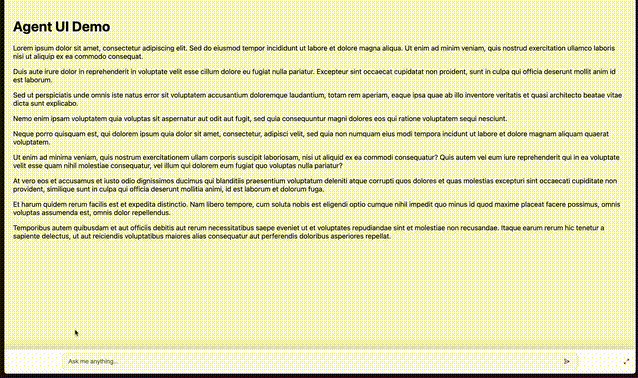

# Agent UI

A small, self-contained agent chat UI you can drop into any page: **one script**, the **`<agent-ui>`** Web Component, and no React or bundler required.

**Layout and interaction**

- **Always-on bar** — A slim **chat and command** strip sits at the bottom of the viewport so the agent is always reachable without dominating the page.
- **Dialog or side panel** — Open the full composer in a **centered dialog**, or use the header control to switch to **side panel mode**: the page stays visible beside the thread (no dimmed full-viewport overlay in panel mode).
- **Simple UX** — Straightforward layout and typography so the widget feels like light page chrome, not a second application.
- **Accessible habits** — Focus moves into the input when you expand, controls expose **`title`** hints, and **⌘/Ctrl+K** toggles open/closed from anywhere on the page.



[Interactive Demo on Codepen.io](https://codepen.io/TVR/full/dPYJmwB)

Use it on static sites, legacy stacks, or internal tools where you do not want a heavy chat SDK. It is also handy for **testing a chat API from the browser**: load the script on any site (including from DevTools), mount the element, and wire `message` events to your endpoint.

As agents become a deeper part of applications, Agent UI offers an opinionated but lightweight surface for chat and commands. From a wire-format perspective it is not tied to one protocol—it can reflect updates from plain text streams, NDJSON events, or full AG-UI/SSE sessions.

- Use plain text when you just want to stream generated text directly into the UI.
- Use [NDJSON](https://github.com/ndjson/ndjson-spec) for lightweight structured events like tokens, errors, and simple tool outputs.
- Use [AG-UI/SSE](https://github.com/ag-ui-protocol/ag-ui) when you want the richest experience, with tool calls, state snapshots/deltas, and multi-channel agent interactions.

No matter which approach your backend supports, you can hook into the stream, parse it appropriately, and keep the UI in sync in real time.

## Including Agent UI in your app or page

### Option 1 — jsDelivr CDN

You can use [jsDelivr](https://www.jsdelivr.com) to load Agent UI from GitHub at any branch, tag, or commit without vendoring files—good for prototypes and zero-dependency pages.

Take any GitHub file URL and convert it to jsDelivr format:

**GitHub source URL:**

```
https://github.com/tvanreenen/agent-ui/blob/v1.0.0/dist/agent-ui.js
```

**jsDelivr CDN URL:**

```
https://cdn.jsdelivr.net/gh/tvanreenen/agent-ui@v1.0.0/dist/agent-ui.js
```

See the [jsDelivr GitHub helper](https://www.jsdelivr.com/github) to convert URLs automatically.

### Option 2 — Pre-built file

Clone the repository, check out the desired version tag, and use `dist/agent-ui.js`. If `dist/` is missing, run `npm install` and `npm run build` first.

### Option 3 — Build from source

Clone the repository, navigate to the project, and run `npm run build` to produce the compiled bundle in `dist/`.

## Using Agent UI in HTML

```html
<!DOCTYPE html>
<html>
<head>
  <script src="agent-ui.js"></script>
</head>
<body>
  <agent-ui></agent-ui>
  <script>
    const widget = document.querySelector('agent-ui');
    widget.addEventListener('message', (event) => {
      widget.appendToLastMessage(`I see that you asked: "${event.detail.query}"`);
    });
  </script>
</body>
</html>
```

## Trying it from the console (any page)

Paste a loader that fetches the script, registers the custom element, and mounts the widget—useful for smoke-testing an API against the site you already have open:

```js
const s = document.createElement('script');
s.src = 'https://cdn.jsdelivr.net/gh/tvanreenen/agent-ui@v1.0.0/dist/agent-ui.js';
s.onload = () => {
  const el = document.createElement('agent-ui');
  document.body.append(el);
  el.addEventListener('message', (e) => {
    console.log('user message:', e.detail.query);
    // Call your API here, then e.g. el.appendToLastMessage('...') with the response
  });
};
document.head.append(s);
```

Adjust the `src` if you use a local file or another tag.

## Built with

[TypeScript](https://github.com/microsoft/TypeScript), [Lit](https://github.com/lit/lit) (Web Components), [Marked](https://github.com/markedjs/marked), [DOMPurify](https://github.com/cure53/DOMPurify), [Lucide Icons](https://github.com/lucide-icons/lucide).
